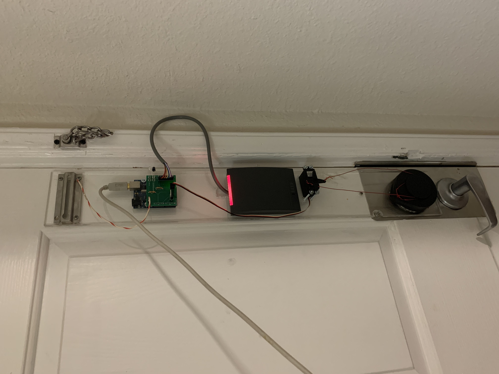
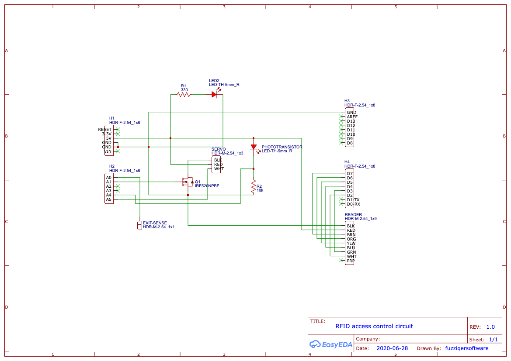

# rfid-access

This project contains the code and schematics for a DIY device that uses a standard RFID reader to control a door lock.

This project uses:
- An Arduino Uno (you can likely use other Arduinos with the same form factor)
- A generic servo
- An HID iClass R40 RFID reader (you can buy these new or used on eBay; many office buildings use them)
- A 3D-printed cover for a deadbolt knob, to lock and unlock the door
- A custom PCB to power the servo and route the reader connections appropriately (but you don't need this - you can also use perfboard or wire manually)

## Hardware setup

Here's what my setup looks like:

This is all on the inside of the door - from the outside, there's no indication at all that there's an RFID reader and computer attached to the door. The R40's read range is long enough that it can read cards through the door, even up to an inch or two away from the outside of the door. You just have to remember approximately where it is on the inside when you tap your card on the outside.

The hardware is all attached to a sheet of acrylic since I live in an apartment and don't want to screw things directly into the door. The acrylic is anchored under some metal door hardware, which also provides a convenient capacitive touch surface - just touch the chain deadbolt receptacle at the top to unlock the door from the inside. (You can hook this up to anything metal by soldering a wire to the EXIT-SENSE pad on the Arduino shield.)

The Arduino is attached to the acrylic with a couple of machine screws, and has a custom shield that implements this schematic:

[Here is the EasyEDA project for the shield](https://easyeda.com/fuzziqersoftware/rfid-access-panel); the exported schematic and PCB files are also included in this repository. I ordered the PCBs through [JLCPCB](https://jlcpcb.com/) (you can do this directly from EasyEDA). The minimum order size is 5 boards, but I really only needed one, so I'll mail you a blank (unassembled) board for free if you tell me where to mail it to. (Offer expires if/when all four are mailed out.)

This board has an IR LED and a phototransistor which the software uses to detect when the door is physically closed. (These should be soldered with plenty of extra wire, so they can be bent toward the doorjamb.) When the door is unlocked, it stays unlocked for at least three seconds and at most ten seconds - after three seconds, if the phototransistor detects the wall nearby at any point, the door will relock then instead of waiting the full ten seconds.

The servo is securely fastened to the acrylic sheet, and the wires from the actuator wrap around the crown of the deadbolt knob cover.

If you have a deadbolt like mine, the deadbolt knob cover I made might also work for you. You can open the included file with Fusion 3D, export it as an STL, slice it into gcode, and 3D print it. Not all deadbolt knobs are the same, so you may need to change the shape a little. It took me eight or so iterations to get the shape right for my deadbolt knob.

The cover has two slits on the bottom side that are used to hold it in place. I stuck some long, thin circuit boards through mine and ran electrical tape around the outside of the knob cover to hold them in, but you could also use toothpicks or popsicle sticks - anything that fits and is rigid. This anchors the cover to the knob, so the wires make it turn the knob when pulled instead of just making it fall off.

## Software setup

After wiring up the reader, open up the included Arduino sketch and upload it to your Arduino. Using the serial monitor, tap your RFID cards to the reader and note the card IDs and bit counts printed in the serial monitor. (After powering it on, ignore the first card that the reader reads - the first serial number read after power-on is often wrong.)

When you've written down the card IDs that you want the unlocker to respond to, go to the TODO section in the code and put them in there. Recompile the sketch, upload it, and verify that the R40 LED turns green for several seconds after you read your predefined cards - this means they will successfully unlock your door once all the hardware is set up.

Happy hacking! Feel free to post any bugs, comments, or feature requests as GitHub issues on this repository.
